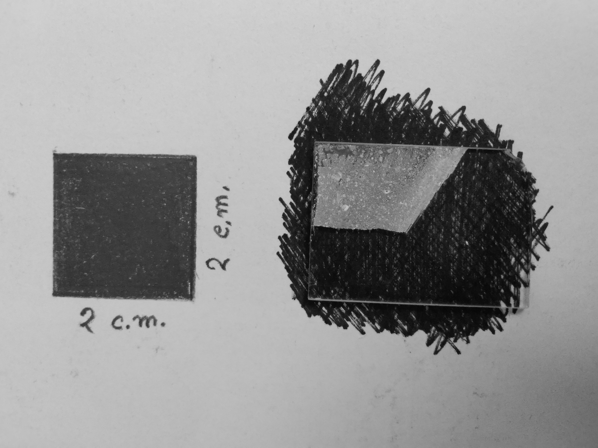
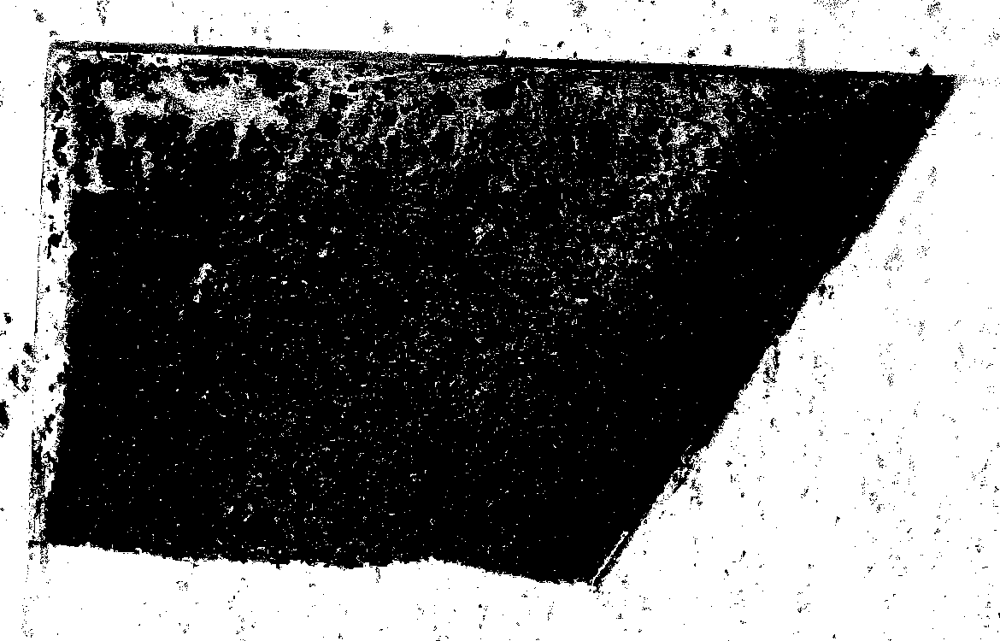
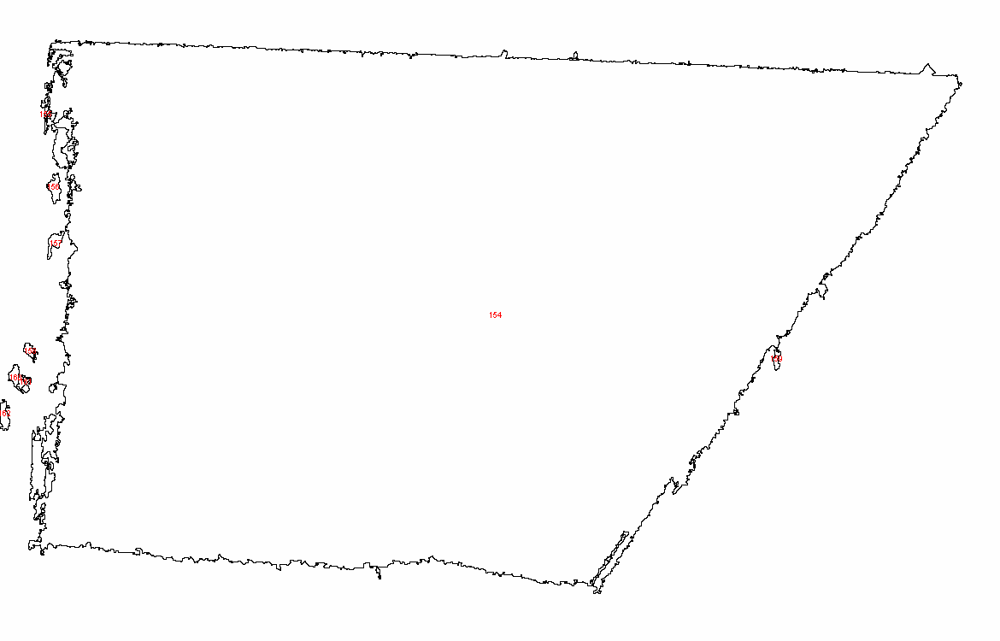

# Film-Thicknss-measurement-using-OpenCV-and-Waight-difference

## Mass Determination

Substrate mass without film = M1

Substrate mass with film = M2

Mass of the film = Mfilm = (M2 – M1)

## Volume Determination
Area of standard square = As

Area of the film = Af

Area of the standard square in real scale = R

Then, area of the film in cm scale  =(A_f/A_s ×R)

Let, the hight (or thickness) of the film be h Volume of the film = A. h
And density D

## Thickness Determination

> then,A.h.D=M_film
> 
> h=M_film/(A.D)

## Experiment

### Images

|
----------------|-------------------------
Normal Image|Finding Edge using ImageJ
|
Film| Film Edge 

### Calculations

> M1 =	2.189 g
> 
> M2 =	2.195 g
> 
> M_film = (M2 – M1) = 	0.006 g
> 
> As =	1015920
> 
> Af =	517878
> 
> A = (517878/1015920×4) = 2.039
> 
> D =	4.23 g/cm3 (rutile), 3.78 g/cm3 (anatase)
> 
> ### h =	0.0006956546 = 6.96 µm (for rutile)
> 
> ### h = 0.0007784706 = 7.78 µm (for anatase) 
> 

